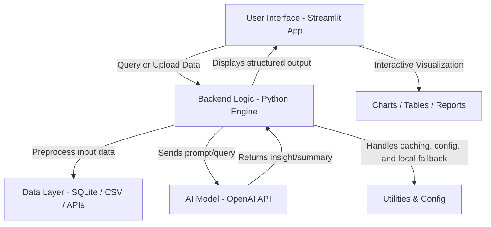

# 🌊 NeerSetu Copilot – AI-Powered Groundwater Insight Tool

**Deployed app:** [🔗 Streamlit App](https://neer-setu-copilot-zzenbrwu3u2jo5d4tlfbd4.streamlit.app/)  
**Demo video:** [🎥 Loom Walkthrough](https://www.loom.com/share/2083791b503b412a81379113c97658cb?sid=502a9b33-3ffb-4de2-b5e3-718013031942)

---

## 🚀 Overview

**NeerSetu Copilot** is an AI-powered groundwater insight and visualization platform built with **Streamlit, SQLite, and OpenAI APIs**.  
It helps users — from policymakers to researchers — query, analyze, and visualize **groundwater trends** (state/district/block level) in plain English or Hindi.  

It bridges **complex hydrogeological data** and **human understanding** by combining structured data analytics with natural language explanations and policy suggestions.

---

## 💡 Why a Tool Like This Matters

- **Groundwater depletion** is one of India’s most pressing ecological crises — over 60% of irrigation and 85% of drinking water comes from it.  
- Data from CGWB/INGRES and district reports are fragmented, technical, and hard to interpret.  
- **NeerSetu Copilot** enables quick insights — “What’s the trend in Dehradun?”, “Which blocks are semi-critical?”, “Define over-exploited stage” — in one click.  
- By combining **data + language models**, it democratizes groundwater information access for **officials, NGOs, students, and researchers.**

---

## 🧠 High-Level Architecture (Monolith Today → Services Later)

```
+---------------------  Streamlit Monolith  ----------------------+
|  UI (chat+filters)  →  Controller (Flow/Intent)                 |
|                                                                |
|  (1) Intent detect: trend | stage | compare | definition        |
|  (2) Data tools:                                             |
|      ├─ SQL tool → SQLite: gw_levels(state,district,block,     |
|      |               year INT, level_m REAL, stage TEXT)       |
|      |        • compute Δ(m/yr), tiny table (last 5 yrs),       |
|      |          latest stage                                    |
|      └─ Keyword-RAG → small corpus (glossary + interventions)  |
|                                                                |
|  (3) Compose once:                                             |
|      ├─ OpenAI Python client  (forced [[LANG=HI|EN]])          |
|      └─ Local fallback (no LLM) if API unavailable             |
|                                                                |
|  (4) Renderer: tiny table + small chart + stage badge +        |
|      Citations footer (“Source + Year(s)”)                     |
+----------------------------------------------------------------+
```

---

### 🪶 Mermaid Architecture Diagram



---

## 🔁 Request Flow (≈10 seconds end-to-end)

1. UI receives query (in Hindi or English).  
2. Controller stamps query with `[[LANG=HI|EN]]`.  
3. Intent detector classifies: **trend / stage / compare / definition.**  
4. SQL tool queries `gw_levels` → computes Δ(m/yr), creates small table, fetches latest stage.  
5. Keyword-RAG fetches relevant policy or glossary text.  
6. OpenAI client (or local fallback) composes a concise response.  
7. Renderer outputs: table, chart, stage badge, citations, and data gaps notice if applicable.

---

## 🧩 Data Model (Core Table)

```sql
gw_levels(
  state TEXT,
  district TEXT,
  block TEXT,
  year INT,
  level_m REAL,      -- meters (below ground level)
  stage TEXT          -- Safe | Semi-critical | Critical | Over-exploited
);
```

---

## ⚙️ Deployment Topologies

### **A. Demo (Monolith)**
- Deployed on **Streamlit Cloud**
- Python `3.11`
- Pinned dependencies  
- Secrets via Streamlit Secrets Manager (`OPENAI_API_KEY`)
- Proxy-neutral runtime, file watcher off

### **B. Pilot / Scale (Split Architecture)**
```
React / Streamlit UI → FastAPI /ask → Postgres (+PostGIS)
                                  ├─ Redis (cache)
                                  └─ pgvector / Chroma (semantic RAG, later)
```

- **Nightly ETL:** INGRES/CGWB exports → validate/transform/load → Postgres  
- **OIDC SSO:** For officer access  
- **Audit logs** & **district dashboards** for transparency  

---

## 🧮 Non-Functional Highlights

| Parameter | Description |
|------------|--------------|
| **Cost/Latency** | Single compose/query per request; cached repeats ≈ ₹0 |
| **Reliability** | Tool-first facts; local fallback when LLM unavailable |
| **Trust** | Citations in footer; “Insufficient data” label when needed |
| **Scalability** | Postgres indexes, PostGIS for GIS, Redis cache, containerization for HA |
| **Languages** | English + Hindi, auto-detected |
| **Security** | Secrets handled via Streamlit Cloud vault, optional OIDC SSO |

---

## 📍 Current Stack

- **Frontend:** Streamlit  
- **Backend:** Python  
- **Database:** SQLite (for demo) → Postgres (for scale)  
- **AI Engine:** OpenAI API (GPT-4-turbo)  
- **Data Sources:** Central Ground Water Board (CGWB), State Water Reports  
- **Visualization:** Matplotlib / Plotly within Streamlit  

---

## 🛣️ Roadmap

- [ ] Integrate Postgres + PostGIS  
- [ ] Add RAG-based semantic search  
- [ ] Enable Hindi summaries with translation consistency  
- [ ] Officer dashboard with role-based insights  
- [ ] Add auto-updated CGWB ETL pipeline  
- [ ] Optimize cost via caching and throttled API calls  

---

_© 2025 NeerSetu Copilot. All rights reserved._


